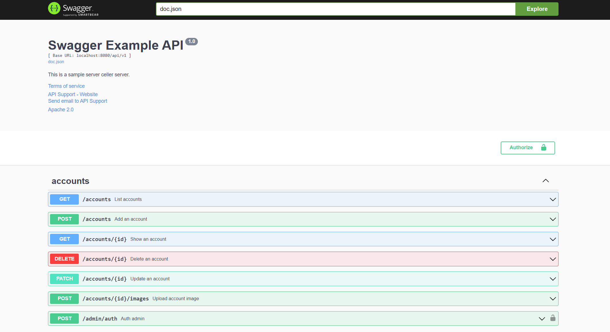

# Go API Example
How to create a REST api with gin and swagger in go.

## Swagger
To generate documentation run `swag init` which will generate and update the contents of the `docs` directory.

``` shell
swag init --parseDependency
```

Then start the application.

``` shell
go run main.go
```

And open the swagger site at [http://localhost:8080/swagger/index.html](http://localhost:8080/swagger/index.html).



## Links
Links for resources used in this example.

- https://github.com/swaggo/swag/blob/master/example/basic/main.go
- https://github.com/swaggo/swag
